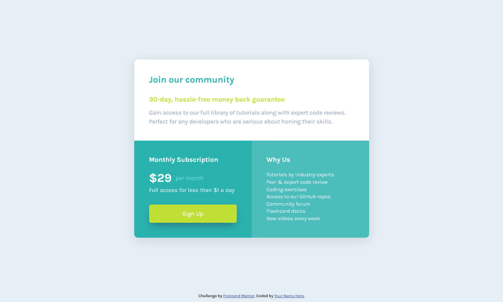

# Frontend Mentor - Single price grid component solution

This is a solution to the [Single price grid component challenge on Frontend Mentor](https://www.frontendmentor.io/challenges/single-price-grid-component-5ce41129d0ff452fec5abbbc). Frontend Mentor challenges help you improve your coding skills by building realistic projects. 

## Table of contents

- [Overview](#overview)
  - [The challenge](#the-challenge)
  - [Screenshot](#screenshot)
  - [Links](#links)
- [My process](#my-process)
  - [Built with](#built-with)
  - [Useful resources](#useful-resources)
- [Author](#author)

## Overview

### The challenge

Users should be able to:

- View the optimal layout for the component depending on their device's screen size
- See a hover state on desktop for the Sign Up call-to-action

### Screenshot

### Links

- Solution URL: [https://www.frontendmentor.io/solutions/bem-oriented-single-price-grid-component-solution-aBQIxy49IC](https://www.frontendmentor.io/solutions/bem-oriented-single-price-grid-component-solution-aBQIxy49IC)
- Live Site URL: [https://my-single-price-grid-component.netlify.app/](https://my-single-price-grid-component.netlify.app/)

## My process

### Built with

- Semantic HTML5 markup
- CSS custom properties
- Flexbox
- CSS Grid
- CSS BEM
- Mobile-first workflow

### Useful resources

- [CSS Scan](https://getcssscan.com/css-box-shadow-examples) - It's a good tool I found with a variety of predefined box shadows to apply directly in the code.
- [Image Color Picker](https://imagecolorpicker.com/) - Since this particular design had troubles with the default color palette, i extracted the exact colors with this tool.
- [Perfect Pixel](https://www.welldonecode.com/perfectpixel/) - Extension I always use to match as many details as i can to the desired design.

## Author

- Frontend Mentor - [@cemijares23](https://www.frontendmentor.io/profile/cemijares23)
